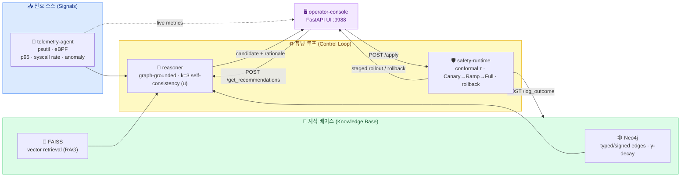
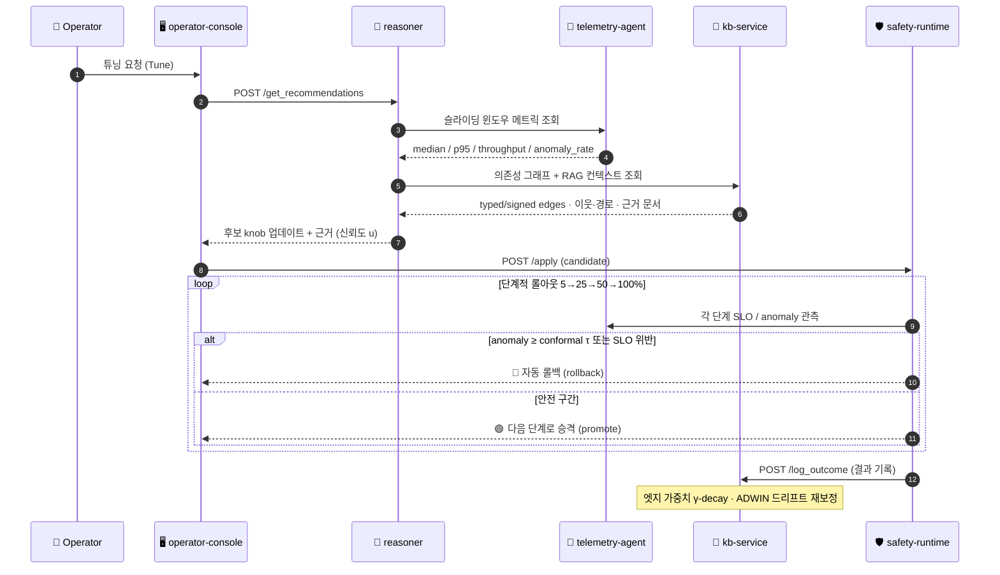

# SemantOS

<p align="center">
  
</p>


A lightweight, containerized **semantic OS tuning** playground that closes the loop between **eBPF-style telemetry**, a **graph-backed knowledge base (Neo4j + FAISS)**, a **Reasoner** that can talk to external LLMs, and a **Safety Runtime** that enforces staged rollouts/automatic rollback. An **Operator Console** (FastAPI) glues the services together.

> This repository is intended for local experimentation, demos, and reproducible benchmarks—not for production hardening.

---

## 🧩 한눈에 보기 (At a Glance)

**SemantOS**는 시스템 신호를 관찰하고(telemetry) → 그래프 지식 베이스에 근거해 튜닝 후보를 추론하고(reasoner) → 안전하게 단계적으로 적용/롤백하는(safety-runtime) **닫힌 제어 루프(closed control loop)** 를 한 번의 `docker compose`로 띄우는 실험용 스택입니다. `operator-console`이 이 모든 서비스를 묶습니다.



| 컴포넌트 | 한줄 역할 (Role) | 포트 |
|----------|------------------|------|
| 📡 `telemetry-agent` | 슬라이딩 윈도우 메트릭 수집 (median/p95, syscall rate, anomaly) | 9100 |
| 🧠 `kb-service` (Neo4j + FAISS) | 타입/부호/가중치가 있는 의존성 그래프 + RAG 검색 | 9101 / 7474 / 7687 |
| 🤖 `reasoner` | 그래프에 근거한 튜닝 후보 생성, k=3 self-consistency 신뢰도 `u` | 9102 |
| 🛡️ `safety-runtime` | conformal τ 기반 단계적 롤아웃(Canary→Ramp→Full)·SLO 가드·자동 롤백 | 9103 |
| 🖥️ `operator-console` | 서비스 오케스트레이션 및 최소 웹 UI/API | **9988** |

---

## 🔄 데이터 흐름 (Data Flow)

한 번의 튜닝 사이클에서 서비스 간 요청/응답이 오가는 순서입니다. 관측(telemetry) → 근거 조회(KB) → 후보 추론(reasoner) → 단계적 적용/롤백(safety-runtime) → 결과 학습(KB)의 흐름을 따릅니다.



> 위 다이어그램은 `proto/semantos-control.v1.yaml` 의 제어 평면(`/get_recommendations`, `/apply`, `/log_outcome`) 엔드포인트와 일대일로 대응합니다.

---

## 📊 Reproducing the paper (offline, no Docker)

The `reproduce/` package regenerates **every table and figure** of the SemantOS
paper from a self-contained, seeded harness (pure `numpy`/`scipy`/`matplotlib`).
It implements the paper's mechanisms causally — the typed/signed dependency
graph, the conformal safety threshold with cost-based selection, ADWIN drift +
sliding-window recalibration, and the theory checks — then prints a PASS/FAIL
report against the paper's numbers with seeds and confidence intervals.

```bash
./reproduce.sh            # installs deps, runs the harness, renders figures
# or:
make reproduce           # harness only (PASS/FAIL vs paper)
make figures             # fig1/fig3/tau-sweep/drift PNGs
```

Expected tail of the run:

```
REPRODUCTION SUMMARY: 34/34 checks passed
```

What it covers: **Table 2** (reductions vs baseline), **Table 3** (KB/RAG/Safety
ablation), **Figure 1** (super-additive knob-pair synergy), **Figure 3**
(anomaly/latency Pareto frontier), the **τ-sweep** (rollback precision/recall/
anomaly + cost-selected τ*), **exploration efficiency**, the **30-day drift
study**, and **Theorem 1 / Proposition 1**. Outputs (CSVs + PNGs) land in
`reproduce/results/`. See `reproduce/README.md` for the module map.

> The reproduction does **not** require Neo4j, an LLM, or any Docker service —
> it is the reproducibility centerpiece. The live services below implement the
> same semantics for interactive use.

---

## ✨ What’s inside

```
semantos/
├─ docker-compose.yml                 # one-command bring-up of all services
├─ docker-compose.ebpf.yml            # extra privileges/mounts for eBPF sampling
├─ Makefile / reproduce.sh            # reproduce + service convenience targets
├─ manual.sh                          # build, up, and tail logs helper
├─ proto/semantos-control.v1.yaml     # REST/OpenAPI for the control plane (typed edges, u/tau)
├─ reproduce/                         # OFFLINE paper reproduction (tables/figures + PASS/FAIL)
├─ kb/                                # induce_edges.py + seed_edges.json (typed dependency graph)
├─ data/                              # generate_pairs.py -> 1000 workload×hardware training pairs
├─ kb-service/                        # Neo4j + FAISS KB: typed/signed/weighted edges, γ-decay, RAG
├─ reasoner/                          # graph-grounded joint reasoning, k=3 self-consistency u
│  └─ train/                          # Llama-3.1-13B 5-stage pipeline (SFT + DPO), config + README
├─ safety-runtime/                    # conformal τ, cost-based selection, staged rollout, drift recal
├─ telemetry-agent/                   # psutil + (optional) eBPF metrics incl. anomaly_rate, throughput
├─ operator-console/                  # simple FastAPI UI (port 9988)
└─ workloads/                         # log-generating workload simulators (illustrative)
```

**Core services & default ports**

| Service           | Port (host:container) | Purpose |
|-------------------|------------------------|---------|
| Neo4j             | 7474, 7687             | Graph KB backing store |
| `kb-service`      | 9101:8000 *(via compose)* | Tunable graph, FAISS retrieval, path/neighbor queries |
| `telemetry-agent` | 9100:8000 *(example)* | Sliding-window metrics (median, p95, syscall rate) |
| `reasoner`        | 9102:8000 *(example)* | Generates explainable tuning candidates |
| `safety-runtime`  | 9103:8000 *(example)* | Canary→Ramp→Full rollouts, SLO guard, rollback |
| `operator-console`| **9988:9988**         | Minimal web UI / API aggregator |

> Tip: If **9988** is taken, change the host port in `docker-compose.yml` (e.g., `8088:9988`). See _Troubleshooting_.

---

## 🧱 Prerequisites

- Docker Engine 24+ and Docker Compose v2
- ~6–8 GB free RAM for Neo4j + Python services
- (Optional) Linux host with kernel headers if you want eBPF sampling
```bash
sudo apt-get update
sudo apt-get install -y linux-headers-$(uname -r)
```

---

## 🚀 Quick start

### 1) Bring up the stack

```bash
# From repo root
docker compose -f docker-compose.yml build
docker compose -f docker-compose.yml up -d

# Or use the convenience script
./manual.sh
```

Once healthy:
- Console: http://localhost:9988
- Neo4j Browser: http://localhost:7474 (user: `neo4j`, pass: `password` by default)

### 2) (Optional) Enable eBPF sampling

If your host supports eBPF and has headers installed, add the privileged bits with the overlay file:

```bash
docker compose -f docker-compose.yml -f docker-compose.ebpf.yml up -d
```

The `telemetry-agent` will attempt to auto-detect eBPF (`USE_EBPF=auto`). You can force it with `USE_EBPF=on`.

---

## 🔌 Services overview

### telemetry-agent
- FastAPI service exposing sliding-window metrics like `median_latency_ms`, `p95_latency_ms`, `sys_enter_rps`, etc.
- Uses `psutil` and—if enabled—basic eBPF probes (via BCC) to enrich signals.
- Env vars: `USE_EBPF=auto|on|off`, `SAMPLE_WINDOW=60`

### kb-service
- Talks to **Neo4j** (graph of tunables and dependencies) and **FAISS** (vector search).
- Provides simple REST endpoints for shortest paths, neighborhood queries, and retrieval support for the reasoner.
- Env vars: `NEO4J_URI`, `NEO4J_USER`, `NEO4J_PASS`, `DATA_DIR=/data`

### reasoner
- Aggregates telemetry + KB context; calls an external LLM (OpenAI/Ollama) when available, otherwise falls back to heuristics.
- Env vars: `KB_URL`, `TELEMETRY_URL`, `OPENAI_API_KEY`, `OPENAI_MODEL`, `OLLAMA_HOST`, `OLLAMA_MODEL`

### safety-runtime
- Staged rollout controller with SLO guardrails and auto-rollback.
- Env vars: `TAU=0.55`, `ROLLOUT_STEPS=5,25,50,100`, `SLO_MAX_P95=35`, `AUTO_POLL=on|off`, `POLL_INTERVAL_SEC=10`

### operator-console
- Small FastAPI app that proxies to the services and serves a minimal UI.
- Exposes port **9988** on the host by default and writes artifacts to `./outputs/` (mounted into the container).

---

## 🧪 Reproducible workloads

Synthetic workload simulators live in `workloads/`. They log CSV-like lines into `./outputs/<workload>/…` with fields such as median, p95, throughput, and anomaly-rate (basis points).

Run them all:

```bash
./workloads/run_workload.sh
```

Or pick a subset:

```bash
./workloads/run_workload.sh web audio
```

---

## 🧭 Control-plane API

OpenAPI spec: `proto/semantos-control.v1.yaml`

- `POST /get_recommendations` — reasoner returns candidate knob updates with rationales
- `POST /apply` — safety runtime applies a candidate via staged rollout
- `POST /log_outcome` — persist outcomes for learning/auditability

These are intentionally minimal for hackability.

---

## ⚙️ Configuration & environment

Common knobs you may want to tweak in `docker-compose.yml`:

- **Ports**: Change the host-side port mapping if something is occupied (e.g., `8088:9988` for operator-console).
- **Neo4j storage**: Named volumes `neo4j_data`, `neo4j_logs` are declared at the bottom of the compose file.
- **eBPF**: Overlay with `docker-compose.ebpf.yml`, and ensure `/lib/modules`, `/usr/src`, and debugfs mounts exist.

---

## 🧰 Troubleshooting

### Port **9988** already allocated
If you see:
```
Bind for 0.0.0.0:9988 failed: port is already allocated
```
Edit `docker-compose.yml` and change the host port mapping for the `operator-console` service, e.g.:
```yaml
  operator-console:
    ports:
      - "8088:9988"   # was 9988:9988
```
Then rerun:
```bash
docker compose up -d --force-recreate
```

### Neo4j connection/auth errors
- Confirm the container is healthy and the env matches `NEO4J_*` in `kb-service`.
- Reset the password via `NEO4J_AUTH=neo4j/<new-pass>` (compose env).

### eBPF permission issues
- Use the `docker-compose.ebpf.yml` overlay (adds `privileged: true`, `pid: "host"`, and relevant mounts).
- Ensure kernel headers and `bcc` tools are available on the host.

### Nothing shows in the console
- Check individual service logs:
  ```bash
  docker compose logs telemetry-agent
  docker compose logs kb-service
  docker compose logs reasoner
  docker compose logs safety-runtime
  docker compose logs operator-console
  ```

---

## 📂 Outputs

All generated artifacts/logs are written under `./outputs/` on the host and mounted into corresponding containers (e.g., safety-runtime, operator-console).

---

## 🔐 Security notes

This is a local demo environment:
- Default credentials, open ports, and permissive CORS may be present.
- **Do not** expose to the public internet without hardening (auth, TLS, network policies, resource limits, etc.).

---

## 📝 License

Apache 2.0
